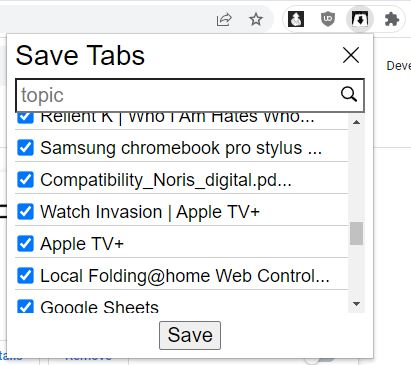
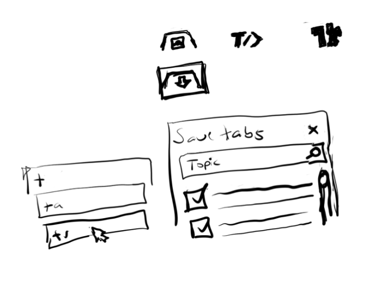

05/21/2023

3:40 PM

Wow... 3 years damn

I still have not built the interface below and now I will. Since I'm getting tired of doing the process of: view extension tab, click background script, refresh, copy into notepad and then forget it/save on some machine somewhere, needs to be stored.

I still have not gotten the unified storage done... I can do E2E encryption but it's with PHP.

Not a problem but it also slows down search since you have to decrypt everything to be able to search against it.

Anyway this interface is pretty easy, I'll have to expand to existing rancid API I built for the cross platform app... since it creates a new row in the database for every single change even a character... awful. I don't know why I built it like that.

I feel like trash right now, already been up almost 4 hours so my mind is getting worse by the hour

Not to mention thinking about needing to get a job, probably going to amazon warehouse lmao, stack boxes like a dumbass (eventualy happens in Dec 2023 and on)

I like the design below, simple and works

By this point (3 years later) I have built more chrome extensions so it's trivial now though I have not migrated to manifest version 3... maybe I have in one extension

3:54 PM

ugh... I don't want to do this but I will, need this tool

even if I save the tabs and never look at them again

4:00 PM

only positive of a new labor job is the interaction with people, new adventure, go back to my roots, I actually had a dream about washing plates last night ha

4:12 PM

reeee my fingers feel gross

4:32 PM

brief break and watching SpaceX launch

4:46 PM

damn that's amazing, ez no cap, auto land ha

5:05 Pm

Ahh listening to some old sound cloud songs nice to get back to the times

I have to modify my existing API/db now

I will use a text field (vs. JSONB)... not sure if a bad decision but will work

Schema is

`id, topics, tabs, date_added`

5:17 PM

distracted

6:29 PM

alright I setup the basic write endpoint

in the future this data would tie into my global personal data store

I've thought about the option to use encrypted/non-encrypted storage

So then it's like daily/bs thoughts are unencrypted, personal is different

then searching "include encrypted?"

anyway please focus and get it done...

this is easy now

6:46 PM

It's done... I tried so many greens but didn't like any I saw

good thing I checked the DB almost saved [object Object] lol

---

old

https://developer.chrome.com/extensions/getstarted

#### 02/17/2020
Following along, not sure yet the purpose of this background script yet for my extension. Onto UI ehh... brain dead

#### 02/16/2020
This is the basic interface so far.

Ehh... probably pointless to try now, so brain dead. I've built at least one extension in the past, full graphics and everything but I think I remember having problems understanding how everything synced together.

Stopped at this line: The extension is now aware that it includes a non-persistent...